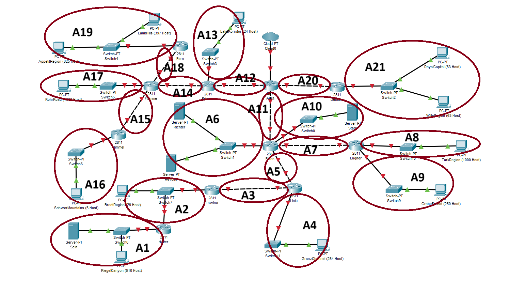

# Jarkom-Modul-4-D11-2023

| Nama                              | NRP        |
| --------------------------------- | ---------- |
| Gracetriana Survinta Septinaputri | 5025211199 |
| Muhammad Rifqi Fadhilah           | 5025211228 |

- [VLSM-GNS3](#vlsm-gns3)
- [CIDR-CPT](#cidr-cpt)

## VLSM-GNS3

### Rute

| Nama Subnet | Rute                                            | Jumlah IP | Netmask |
| ----------- | ----------------------------------------------- | --------- | ------- |
| A1          | Heiter-Switch8-Sein-Switch8-RiegelCanyon        | 512       | /22     |
| A2          | Lawine-Switch7-BredtRegion-Switch7-Heiter       | 31        | /26     |
| A3          | Lawine-Linie                                    | 2         | /30     |
| A4          | Linie-Switch11-GranzChannel                     | 255       | /23     |
| A5          | Eisen-Linie                                     | 2         | /30     |
| A6          | Eisen-Switch1-Richter-Switch1-Revolte           | 3         | /29     |
| A7          | Eisen-Lugner                                    | 2         | /30     |
| A8          | Lugner-Switch10-TurkRegion                      | 1001      | /22     |
| A9          | Lugner-Switch9-GrobeForest                      | 251       | /24     |
| A10         | Eisen-Switch0-Stark                             | 2         | /30     |
| A11         | Aura-Eisen                                      | 2         | /30     |
| A12         | Aura-Frieren                                    | 2         | /30     |
| A13         | Frieren-Switch3-LakeKorridor                    | 25        | /27     |
| A14         | Frieren-Flamme                                  | 2         | /30     |
| A15         | Flamme-Himmel                                   | 2         | /30     |
| A16         | Himmel-Switch6-SchwerMountains                  | 6         | /29     |
| A17         | Flamme-Switch5-RohrRoad                         | 1001      | /22     |
| A18         | Flamme-Fern                                     | 2         | /30     |
| A19         | Fern-Switch4-LaubHills-Switch4-AppetitRegion    | 1023      | /21     |
| A20         | Aura-Denken                                     | 2         | /30     |
| A21         | Denken-Switch2-RoyalCapital-Switch2-WilleRegion | 127       | /24     |
| Total       |                                                 | 4255      | /19     |

### Pohon IP

#### Pembagian IP berdasarkan Pohon IP

| Subnet | Network ID  | Netmask         | Broadcast    |
| ------ | ----------- | --------------- | ------------ |
| A1     | 10.27.16.0  | 255.255.252.0   | 10.27.19.255 |
| A2     | 10.27.0.128 | 255.255.255.192 | 10.27.0.191  |
| A3     | 10.27.0.36  | 255.255.255.252 | 10.27.0.39   |
| A4     | 10.27.6.0   | 255.255.254.0   | 10.27.7.255  |
| A5     | 10.27.0.32  | 255.255.255.252 | 10.27.0.35   |
| A6     | 10.27.0.48  | 255.255.255.248 | 10.27.0.55   |
| A7     | 10.27.0.28  | 255.255.255.252 | 10.27.0.31   |
| A8     | 10.27.12.0  | 255.255.252.0   | 10.27.15.255 |
| A9     | 10.27.4.0   | 255.255.255.0   | 10.27.4.255  |
| A10    | 10.27.0.24  | 255.255.255.252 | 10.27.0.27   |
| A11    | 10.27.0.20  | 255.255.255.252 | 10.27.0.23   |
| A12    | 10.27.0.16  | 255.255.255.252 | 10.27.0.19   |
| A13    | 10.27.0.64  | 255.255.255.224 | 10.27.0.95   |
| A14    | 10.27.0.12  | 255.255.255.252 | 10.27.0.15   |
| A15    | 10.27.0.8   | 255.255.255.252 | 10.27.0.11   |
| A16    | 10.27.0.40  | 255.255.255.248 | 10.27.0.47   |
| A17    | 10.27.8.0   | 255.255.252.0   | 10.27.11.255 |
| A18    | 10.27.0.4   | 255.255.255.252 | 10.27.0.7    |
| A19    | 10.27.24.0  | 255.255.248.0   | 10.27.31.255 |
| A20    | 10.27.0.0   | 255.255.255.252 | 10.27.0.3    |
| A21    | 10.27.2.0   | 255.255.255.0   | 10.27.2.255  |

### Topologi

